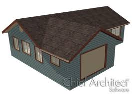
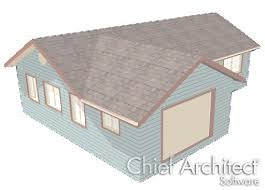

# ☀️ Solar Industry AI Assistant

An AI-powered rooftop analysis tool that uses satellite images to estimate solar panel installation potential, return on investment (ROI), and environmental impact.

---

## 🚀 Project Overview

This web application allows users to:
- Upload a satellite/top-down image of a building
- Detect usable rooftop area using image processing
- Simulate AI-based rooftop metadata analysis (roof type, shading)
- Calculate:
  - Number of solar panels that can be installed
  - Expected energy production (kWh/year)
  - Installation cost & yearly savings
  - Payback period (ROI)
  - Annual CO₂ savings

---

## 🧠 Core Features

- ✅ Upload rooftop images or enter area manually
- ✅ AI-simulated rooftop insights (roof type, shading, confidence)
- ✅ Rooftop area detection using OpenCV
- ✅ Solar panel calculation and energy output
- ✅ Financial estimates: installation cost, ROI, savings
- ✅ Environmental benefit: CO₂ saved per year
- ✅ Streamlit-based web interface

---

## 📸 Example Output

| Uploaded Image | Rooftop Mask Overlay |
|----------------|----------------------|
|  |  |

---

## 🛠 Tech Stack

- Python
- OpenCV
- Streamlit
- NumPy
- PIL (Pillow)

---

## 📦 Installation (Local)

1. Clone the repo:
```bash```
    git clone https://github.com/jais001-sushant/Solar-AI-Assistant.git
    cd solar-ai-assistant

2. Install dependencies:
    pip install -r requirements.txt

3. Run the app:
    streamlit run app.py
