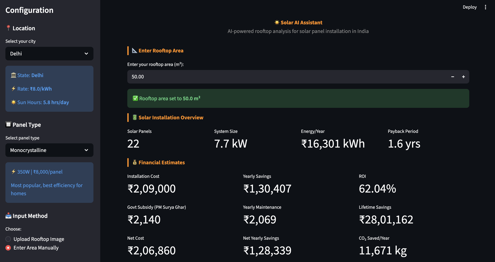

# ☀️ Solar AI Assistant

An AI-powered rooftop analysis web app that helps Indian homeowners estimate solar panel installation potential, return on investment, and environmental impact — built with Python and Streamlit.

---

## 🖼️ Preview


---

## 🚀 Live Demo
👉 [Click here to view the app](https://your-app-link.streamlit.app)

---

## ✨ Features

- 📤 **Rooftop Image Upload** — Upload satellite/top-down image for automatic area detection
- 📐 **Manual Area Input** — Enter rooftop area manually as an alternative
- 🧠 **AI Rooftop Analysis** — Claude AI analyses roof type, shading, condition and orientation
- 📍 **20 Indian Cities** — City-wise sun hours for accurate energy estimates
- ⚡ **State Electricity Rates** — Real state-wise electricity rates across India
- 🔲 **3 Panel Types** — Polycrystalline, Monocrystalline and Bifacial
- 🏛️ **PM Surya Ghar Subsidy** — Real government subsidy calculation
- 📊 **3 Interactive Charts** — ROI projection, monthly energy, cost breakdown
- 🌱 **Environmental Impact** — CO₂ savings and carbon credit value
- 📄 **PDF Report Download** — Professional downloadable report

---

## 🧠 How It Works

```
User uploads rooftop image
        ↓
OpenCV detects rooftop area
        ↓
Claude AI analyses roof type, shading & condition
        ↓
Calculations based on city, panel type & state rates
        ↓
Full financial + environmental estimates displayed
        ↓
User downloads PDF report
```

---

## 🛠️ Tech Stack

- **Python** — Core language
- **Streamlit** — Web interface
- **OpenCV** — Rooftop image detection
- **Anthropic Claude API** — AI rooftop analysis
- **Plotly** — Interactive charts
- **ReportLab** — PDF generation
- **Pandas** — Data handling
- **Pillow** — Image processing

---

## 📂 Project Structure

```
Solar AI Assistant/
│
├── app.py                  ← Main Streamlit app
├── ai_analysis.py          ← Claude API rooftop analysis
├── image_analysis.py       ← OpenCV rooftop detection
├── roi_calculator.py       ← Financial calculations
├── pdf_report.py           ← PDF report generation
├── utils.py                ← Helper functions
│
├── data/
│   ├── __init__.py
│   └── india_data.py       ← Cities, rates, panel data
│
├── .env                    ← API key (not pushed to GitHub)
├── .gitignore
├── requirements.txt
└── README.md
```

---

## 🗃️ Data Included

- **20 cities** with real solar peak hours
- **14 states** with current electricity rates
- **3 panel types** with real market prices
- **PM Surya Ghar** subsidy slabs (real govt scheme)
- **Monthly solar factors** for seasonal energy breakdown
- **India grid CO₂** factor — 0.716 kg/kWh

---

## 📦 Installation (Local)

**Step 1 — Clone the repository**
```bash
git clone https://github.com/jais001-sushant/Solar-AI-Assistant.git
cd solar-ai-assistant
```

**Step 2 — Create virtual environment**
```bash
python3 -m venv venv
source venv/bin/activate
```

**Step 3 — Install dependencies**
```bash
pip install -r requirements.txt
```

**Step 4 — Set up environment variables**

Create a `.env` file in the project root:
```
ANTHROPIC_API_KEY=your-api-key-here
```

**Step 5 — Run the app**
```bash
streamlit run app.py
```

Open `http://localhost:8501` in your browser.

---

## ⚙️ Configuration

The app works without an API key — all financial calculations are fully functional. The Anthropic API key is only needed for the AI rooftop analysis feature (roof type, shading detection etc).
